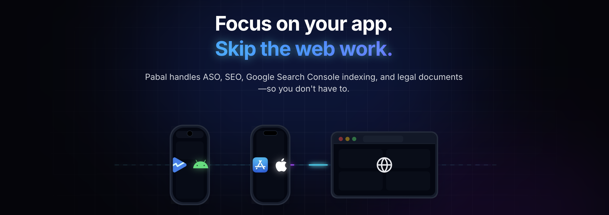

[](https://cursor.com/en/install-mcp?name=pabal-store-api-mcp&config=eyJjb21tYW5kIjoibnB4IiwiYXJncyI6WyIteSIsInBhYmFsLW1jcCJdfQ%3D%3D)

# pabal-store-api-mcp — App Store / Play Store ASO용 MCP 서버

앱스토어/플레이스토어 메타데이터, 릴리스, ASO 동기화를 MCP 도구로 제공합니다. Claude Code, Cursor, MCP Inspector 등 MCP 클라이언트에서 stdio 서버로 실행해 바로 사용할 수 있습니다.

> [!NOTE]
> 100% 로컬에서 실행되어 자격 증명과 캐시된 ASO 데이터가 외부로 전송되지 않습니다. 스토어 API 호출도 당신의 로컬 머신에서 직접 수행합니다.

<br>

## ❌ pabal-store-api-mcp 없이

- 스토어마다 클릭하며 업데이트
- 로캘·릴리스 노트 복붙 오류
- 프로젝트마다 반복 설정

<br>

## ✅ pabal-mcp와 함께

- 두 스토어 ASO 풀/푸시를 한 서버에서 처리
- 릴리스 노트 업데이트·버전 체크를 AI 클라이언트 안에서 수행
- 로컬 캐시/설정 기반의 재사용 가능한 워크플로

<br>

## 🛠️ MCP 클라이언트 설치

### 요구 사항

- Node.js 18 이상
- MCP 클라이언트: Cursor, Claude Code, VS Code, Windsurf

> [!TIP]
> ASO/스토어 작업을 자주 한다면 MCP 규칙에 "항상 pabal-store-api-mcp 사용" 같은 자동 호출 규칙을 추가하세요.

### 전역 설치(권장)

```bash
npm install -g pabal-store-api-mcp
# 또는
yarn global add pabal-store-api-mcp
```

최신 버전으로 업데이트하려면:

```bash
npm install -g pabal-store-api-mcp@latest
# 또는
yarn global add pabal-store-api-mcp@latest
```

전역 설치를 먼저 권장합니다. 프록시/방화벽·오프라인 환경에서 npm 다운로드 문제를 피하고 더 빨리 시작할 수 있습니다. `npx -y pabal-store-api-mcp`도 가능하지만 전역 설치가 기본 권장 경로입니다. 전역 설치 후 MCP 설정에서는 `command: "pabal-store-api-mcp"`로 바로 사용할 수 있습니다(`npx` 불필요).

### Cursor

`~/.cursor/mcp.json` 또는 프로젝트 `.cursor/mcp.json`에 추가:

```json
{
  "mcpServers": {
    "pabal-store-api-mcp": {
      "command": "npx",
      "args": ["-y", "pabal-store-api-mcp"]
    }
  }
}
```

### VS Code

`settings.json` 예시:

```json
"mcp": {
  "servers": {
    "pabal-store-api-mcp": {
      "type": "stdio",
      "command": "npx",
      "args": ["-y", "pabal-store-api-mcp"]
    }
  }
}
```

### Claude Code

> [!TIP]
> 자세한 설정 옵션은 [Claude Code MCP 공식 문서](https://code.claude.com/docs/en/mcp#setting-up-enterprise-mcp-configuration)를 참고하세요.

Claude Code MCP 설정에 추가 (JSON 형식):

```json
{
  "mcpServers": {
    "pabal-store-api-mcp": {
      "command": "npx",
      "args": ["-y", "pabal-store-api-mcp"]
    }
  }
}
```

전역 설치(`npm install -g pabal-store-api-mcp`) 후에는:

```json
{
  "mcpServers": {
    "pabal-store-api-mcp": {
      "command": "pabal-store-api-mcp"
    }
  }
}
```

### Windsurf

```json
{
  "mcpServers": {
    "pabal-store-api-mcp": {
      "command": "npx",
      "args": ["-y", "pabal-store-api-mcp"]
    }
  }
}
```

<br>

## 🔐 자격 증명 설정

1. 설정 디렉터리 생성 및 권한 설정:

```bash
mkdir -p ~/.config/pabal-mcp
chmod 700 ~/.config/pabal-mcp
```

2. 플레이스홀더가 채워진 설정 파일 생성:

```bash
cat <<'EOF' > ~/.config/pabal-mcp/config.json
{
  "dataDir": "/ABSOLUTE/PATH/TO/pabal-web",
  "appStore": {
    "issuerId": "xxxx",
    "keyId": "xxxx",
    "privateKeyPath": "./app-store-key.p8"
  },
  "googlePlay": {
    "serviceAccountKeyPath": "./google-play-service-account.json"
  }
}
EOF
```

다음 단계에서 App Store Connect 키를 확인한 뒤 `issuerId`, `keyId` 값을 실제 값으로 바꿔주세요.
`dataDir`는 각 스토어에서 내려받은 raw 데이터를 저장하는 절대 경로입니다 (예: `/ABSOLUTE/PATH/TO/pabal-web`).

3. `~/.config/pabal-mcp/`에 자격 증명 추가:

   **App Store Connect API 키**:
   - App Store Connect → Users and Access → [Keys](https://appstoreconnect.apple.com/access/integrations/api) → "Generate API Key"에서 Admin/App Manager 권한으로 키 생성 후 `.p8`를 다운로드합니다(한 번만 가능). `~/.config/pabal-mcp/app-store-key.p8`로 저장하세요.
   - 키 상세 화면에서 Issuer ID와 Key ID를 복사한 뒤 `~/.config/pabal-mcp/config.json`의 `issuerId`, `keyId`에 반영하세요.

   **Google Play 서비스 계정 JSON**:
   - [Google Cloud 서비스 계정 관리](https://console.cloud.google.com/projectselector2/iam-admin/serviceaccounts?supportedpurview=project) → 새 서비스 계정 생성(이름은 `pabal` 권장) → 키 생성 → JSON 다운로드.
   - 다운로드한 JSON을 `~/.config/pabal-mcp/google-play-service-account.json`으로 저장합니다.
   - Play Console → [사용자 및 권한](https://play.google.com/console/u/0/developers/users-and-permissions) → 새 사용자 초대 → 서비스 계정 이메일 입력.
     - 앱 권한: ASO 작업할 앱들을 선택.
     - 계정 권한: 아래 항목을 체크:
       - 앱 정보 보기 및 보고서 일괄 다운로드(읽기 전용)
       - 앱 초안 생성·수정·삭제
       - 프로덕션으로 출시
       - 기기 제외 목록 관리
       - Play 앱 서명 사용
       - 스토어 노출(스토어 프레즌스) 관리

   **설정 파일 형태 (ID 업데이트 후)**:

   ```json
   {
     "dataDir": "/ABSOLUTE/PATH/TO/pabal-web",
     "appStore": {
       "issuerId": "<your-issuer-id>",
       "keyId": "<your-key-id>",
       "privateKeyPath": "./app-store-key.p8"
     },
     "googlePlay": {
       "serviceAccountKeyPath": "./google-play-service-account.json"
     }
   }
   ```

4. 스토어 데이터 가져오기

   `apps-init`을 사용해 스토어 API에서 앱을 가져와 자동 등록합니다.
   이 명령은 `~/.config/pabal-mcp/registered-apps.json`에 스토어에서 사용 가능한 앱들을 저장합니다. 자세한 형식은 [앱 관리 도구](./apps.md)를 참고하세요.

5. 파일 권한 잠그기 (폴더 내 모든 파일):

```bash
chmod 600 ~/.config/pabal-mcp/*
```

`~/.config/pabal-mcp/` 아래 모든 파일에 적용됩니다. 새 자격 증명 파일을 추가할 때마다 다시 실행하세요.

<br>

## 🔧 MCP 도구

- 인증
  - `auth-check`: App Store Connect / Google Play 인증 상태 확인
- 앱 관리
  - `apps-init`: 스토어 API에서 앱을 가져와 자동 등록 (Google Play는 `packageName` 필요)
  - `apps-add`: bundleId/packageName으로 단일 앱 등록
  - `apps-search`: 등록된 앱 검색
- ASO 동기화
  - `aso-pull`: ASO 데이터를 로컬 캐시(.aso/)에 가져오기
  - `aso-push`: 로컬 캐시(.aso/)의 ASO 데이터를 스토어에 반영
- 릴리스 관리
  - `release-check-versions`: 앱별 최신 버전 조회
  - `release-create`: 새 버전 생성
  - `release-pull-notes`: 릴리스 노트를 로컬 캐시(.aso/)에 가져오기
  - `release-update-notes`: 릴리스 노트/What's New 업데이트

<br>

## 🏗️ 개발

### 소스에서 실행

```bash
git clone https://github.com/quartz-labs-dev/pabal-store-api-mcp.git
cd pabal-store-api-mcp
yarn install
yarn dev:mcp
```

### 테스트

전체 테스트 실행: `npm test`

<br>

---

<br>

## 🌐 Pabal Web

ASO와 SEO를 함께 관리하고 싶으신가요? **Pabal Web**을 확인해보세요.

[](https://pabal.quartz.best/)

**Pabal Web**은 Next.js 기반의 웹 인터페이스로, ASO, SEO, Google Search Console 인덱싱 등을 통합 관리할 수 있는 완전한 솔루션입니다.

👉 [Pabal Web 방문하기](https://pabal.quartz.best/)
